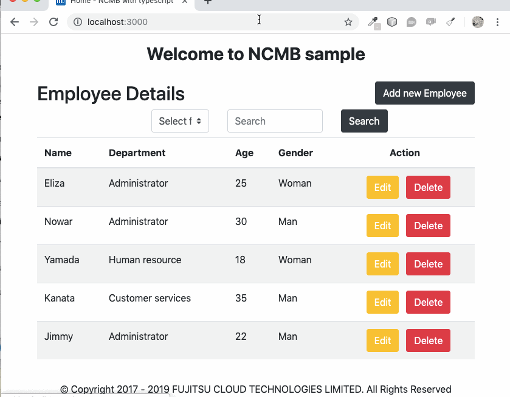

# NCMB SDK implement with typescript + nodejs
## **Employee Management**  
Ứng dụng demo dùng Typescript và nodejs cài đặt với NCMB SDK.  
Ứng dụng quản lý nhân viên bao gồm các chức năng: thêm, sửa, xoá và tìm kiếm nhân viên.  



# Các chức năng của ứng dụng:
* [x] Thêm một nhân viên mới.
* [x] Sửa chữa thông tin của nhân viên.
* [x] Tìm kiếm nhân viên thông qua tên, bộ phận, tuổi, giới tính.
* [x] Xoá nhân viên.

# Nội dung:
- [ニフクラ mobile backendって何？？](#ニフクラ-mobile-backendって何？？)  
- [Chuẩn bị môi trường](#Chuẩn-bị-môi-trường)  
- [Bắt đầu](#Bắt-đầu)  
- [Tham khảo](#Tham-khảo)

# ニフクラ mobile backendって何？？
* スマートフォンアプリのバックエンド機能（プッシュ通知・データストア・会員管理・ファイルストア・SNS連携・位置情報検索・スクリプト）が開発不要、しかも基本無料(注1)で使えるクラウドサービス！
* 注1：詳しくは[こちら](https://mbaas.nifcloud.com/price.htm)をご覧ください


# Chuẩn bị môi trường
Để có thể thực thi ứng dụng local ta cần cài đặt môi trường như bên dưới:
1. Cài đặt [Node.js](https://nodejs.org/en/)
1. Cài đặt [VS Code](https://code.visualstudio.com/)
1. Cài đặt [Typescript](https://www.npmjs.com/package/typescript)  
TypeScript được cài đặt dễ dàng thông qua `npm`.
```
npm install -g typescript
```

# Bắt đầu

## 1. Đăng ký tài khoản Nifclound và tạo ứng dụng mới.
- Thực hiện đăng ký tài khoản nifclound nếu bạn chưa có tài khoản [Đăng ký](https://console.mbaas.nifcloud.com/signup)  
- Sau khi đăng ký, đăng nhập và tạo một ứng dụng mới như bên dưới:
  
- Khi một ứng mới được tạo, bạn sẽ nhìn thấy màn hình như bên dưới. 
- Có 2 loại key cửa API là application key and client key. 
  

## 2. Clone source code từ repository
```
git clone --depth=1 https://github.com/vfa-tamhh/ncmb_typescript.git <project_name>
```
- Cài đặt dependencies
```
cd <project_name>
npm install
```
## 3. Mở ứng dụng bằng VScode.
- File -> open -> chọn project  

- Cấu trúc thư mục như bên dưới:  


## 4. Thiết lập API key
- Mở file `.env` và thay đổi `YOUR_APPLICATION_KEY` và `YOUR_CLIENT_KEY` Bạn chỉ cần sao chép và dán các key tương ứng:


## 5. Thiết lập dữ liệu cho ứng dụng.
- Login vào Nifclound mbaas Datastore -> +Create -> Import  
  

- Sau đó chọn file dữ liệu `Data/employee.json` để import và đặt tên class là `Employee`  
  

- Dữ liệu sau khi import sẽ như bên dưới:  
  

## 6. Thực hiện build và kiểm tra kết quả của ứng dụng.
```
cd <project_name>
npm run build
npm run start
```
- Mở trình duyệt và dán `http://127.0.0.1:3000` vào thanh địa chỉ sau đó nhấn phím enter.
- Thực hiện thêm một nhân viên mới, nhấn vào nút `[Add new Employee]`

- Điền các thông tin các trường như hình bên dưới và sau đó nhấn `[Save]`:

- Kiểm tra kết quả ở Nifclound console.


# Tham khảo
  ## 1. Giải thích về cấu trúc của dự án.

TypeScript (`.ts`) files trong thư mục `src` sau khi compile sẽ thành file JavaScript (`.js`) trong thư mục `dist`.
Thư mục `views` nằm trong thư mục gốc.

Các thư mục được giải thích như bên dưới:

> **Chú ý!** Chắc chắn rằng bạn đã build ứng dụng bởi lệnh `npm run build`

| Tên thư mục | Mô tả |
| ------------------------ | --------------------------------------------------------------------------------------------- |
| **dist**                 | Chứa phần code của bạn sau build                                                              |
| **node_modules**         | Chứa tất cả các npm dependencies                                                              |
| **src**                  | Chứa source code typescript, khi compile sẽ được chép vào thư mục dist                        |
| **src/controllers**      | Chứa các file điều hướng request từ http.                                                     |
| **src/public**           | Chứa các file dùng cho front-end.                                                             |
| **src/types**            | Chứa ncmb.d.ts files                                                                          |
| **src**/server.ts        | Entry point to your express app                                                               |
| **views**                | Chứa các file pug template dùng để render HTML.                                               |
| .env             | Chứa `YOUR_APPLICATION_KEY` và `YOUR_CLIENT_KEY`                                                                                      |
| .copyStaticAssets.ts     | Script dùng để copy images, css, và JS vào thư mục dist                                       |
| package.json             | Chứa các dependencies sử dụng trong dự án.                                                    |
| tsconfig.json            | Cấu hình compile trong TypeScript                                                             |

### Cấu hình trình biên soạn TypeScript
TypeScript sử dụng file `tsconfig.json` để điều chỉnh tuỳ chọn cho việc biên soạn của dự án [Tham khảo](https://www.typescriptlang.org/docs/handbook/tsconfig-json.html) để biết thêm về việc cấu hình.
```json
"compilerOptions": {
    "module": "commonjs",
    "esModuleInterop": true,
    "target": "es6",
    "noImplicitAny": false,
    "moduleResolution": "node",
    "sourceMap": true,
    "outDir": "dist",
    "baseUrl": ".",
    "paths": {
        "*": [
            "node_modules/*",
            "src/types/*"
        ]
    }
},
"include": [
    "src/**/*.ts"
]
```
  ## 2. Giải thích về source code.
  - ncmb SDK được sử dụng là phiên bản v3.0.0 được cấu hình ở file `package.json`.
  ```json
  "dependencies": {
    ...
    "ncmb": "^3.0.0",
    ...
  }
  ```
  - Thực hiện DefinitelyTyped cho ncmb SDK bằng việc sử dụng tool [dst-gen](https://github.com/Microsoft/dts-gen)
  ```
  dts-gen -m ncmb
  ```
  - Sau khi thực hiện DefinitelyTyped sẽ sinh ra file `ncmb.d.ts` chúng ta chép `ncmb.d.ts` và thư mục `src/types`
  - Bằng việc cấu hình `tsconfig.json` sẽ cấu hình ánh xạ đến `ncmb.d.ts` vừa được tạo ra ở bước phía trên.
  ```json
  "baseUrl": ".",
  "paths": {
        "*": [
            "node_modules/*",
            "src/types/*"
        ]
    }
  ```
  - Thực hiện cấu hình `YOUR_APPLICATION_KEY` và `YOUR_CLIENT_KEY` ở file `.env`
  - Tạo file `src/services/baseService.ts` để thực hiện khởi tạo ncmb.
  ```ts
  import NCMB from "ncmb";
export default class BaseService {
    public ncmb: any
    constructor () {
        // Get application key from env file
        let appKey = process.env.YOUR_APPLICATION_KEY
        // Get client key from env file
        let clientKey = process.env.YOUR_CLIENT_KEY
        this.ncmb = new NCMB(appKey,clientKey,"")
    }
}
  ```

  - Tạo file `src/services/employeeService.ts` để thực hiện chức năng thêm, sửa, xoá, và tìm kiếm nhân viên.
  ```ts
  import BaseService from "./baseservice";

class EmployeeServices extends BaseService {
    constructor () {
        super()
    }

    /**
     * Get all Employee
     */
    public async getEmployees() {
        let employeeObject = this.ncmb.DataStore("Employee")
        let object = {}
        await employeeObject.fetchAll()
        .then(function(results) {
            object = results;
        })
        .catch(function(err){
            console.log(err);
        });
        return object
    }

    ...
}
export default new EmployeeServices()
  ```
  - Tạo file `src/controllers/home.ts` để thực hiện điều hướng và render đến các file giao diện (pug template)
  ```ts
  import { Request, Response } from "express";
import employeeServices from "../services/employeeServices";

/**
 * GET /
 * Home page.
 */
export const index = async (req: Request, res: Response) => {
  var employee = await employeeServices.getEmployees()
  res.render("home", {
    title: "Home",
    employee: employee
  });
};

...
  ```
   - Tạo file `views/home.pug` để hiển thị các giá trị được trả về từ `src/controllers/home.ts`
   ```js
   extends layout

block content
  div.header-title Welcome to NCMB sample
  br
  div.row
    div.col-md-6.align-self-center
      h2 Employee Details
    div.col-md-6
      button.btn.btn-dark(id ="btn-new" type="button") Add new Employee
  form(action="../employee/search" method="post")
    div.row
      div.col-md-3
      div.col-md-2
        select.browser-default.custom-select(name="colName")
          option(value="None" selected=(colName == 'None') ) Select filed
          option(value="Name" selected=(colName == 'Name') ) Name
          option(value="Department" selected=(colName == 'Department') ) Department
          option(value="Age" selected=(colName == 'Age')) Age
          option(value="Gender" selected=(colName == 'Gender')) Gender
      div.col-md-3
        input.form-control(type="text" placeholder="Search" aria-label="Search" name="searchCondition" value=(searchCondition) )
      div.col-md-1
        button.btn.btn-dark(type='submit') Search
      div.col-md-3

  table.table.table-striped.table-hover.table-main
    thead
      tr
        th(scope='col') Name
        th(scope='col') Department
        th(scope='col') Age
        th(scope='col') Gender
        th.action(scope='col') Action
    tbody
      if employee
        each val in employee
          tr
            td= val.Name
            td= val.Department
            td= val.Age
            if val.Gender == 1
              td Man
            else
              td Woman
            td.action
              button.btn-edit.btn.btn-warning(type="button" data-id=(val.objectId)) Edit 
              button.btn-delete.btn.btn-danger(type="button" data-id=(val.objectId) data-name=(val.Name)) Delete
        else
          tr
            td.no-data-result(colspan="5") No result data.
      else
        tr
          td.no-data-result(colspan="5") No entry data.
   ```
# Contributing
- Fork it!
- Create your feature branch: git checkout -b my-new-feature
- Commit your changes: git commit -am 'Add some feature'
- Push to the branch: git push origin my-new-feature
- Submit a pull request :D
# License
MITライセンス  
NIFCloud mobile backendのJavascript SDKのライセンス

